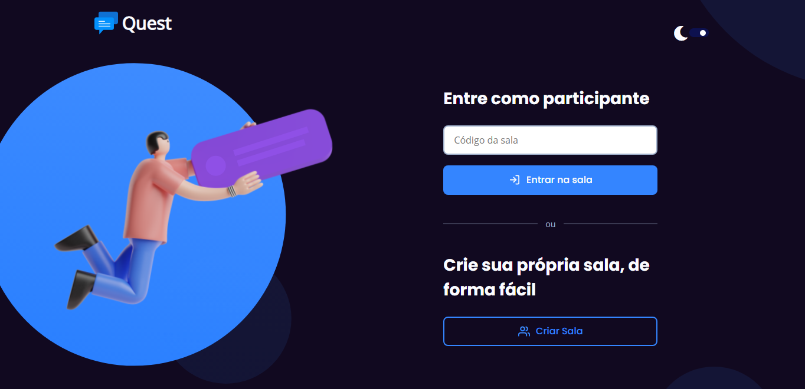

<h1 align="center">
   Quest
</h1>

  <a href="#-tecnologias">Tecnologias</a>&nbsp;&nbsp;&nbsp;|&nbsp;&nbsp;&nbsp;
  <a href="#-projeto">Projeto</a>&nbsp;&nbsp;&nbsp;|&nbsp;&nbsp;&nbsp;
  <a href="#-layout">LNLW Together</a>&nbsp;&nbsp;&nbsp;|&nbsp;&nbsp;&nbsp;

 

  

## 🚀 Tecnologias

Esse projeto foi desenvolvido com as seguintes tecnologias:

- HTML
- CSS
- JavaScript
- NodeJS
- EJS
- Express
- SQLite

## 💻 Projeto

O Quest originalmente chamada de Rocket.Q é uma aplicação de interação através de perguntas, sendo possível criar uma sala para internautas anônimos fazerem perguntas e o criador da sala em posse de uma senha gerenciar essas perguntas e marcar como lidas.

## 🔖 NLW Together

Todo esse projeto foi desenvlvido durante o evento NLW Together da Rocketseat, com o acompanhamento da instrutora Jak Graciely. 

  Deixo meu agradecimento a Rocketseat pela oportunidade de desenvolver um projeto tão lindo e principalmente por ter ampliado ainda mais meus conhecimentos

